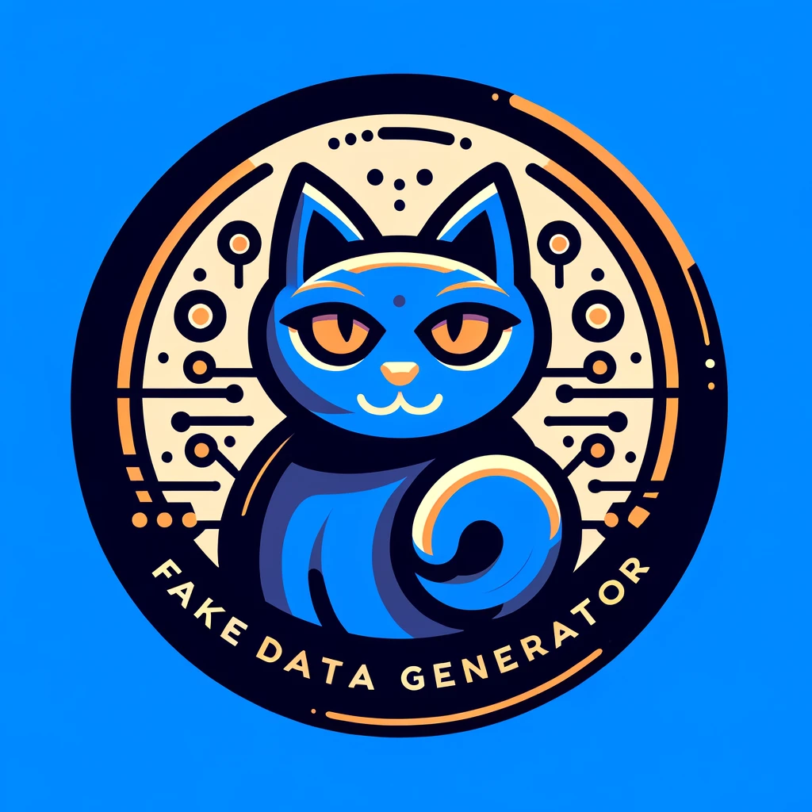

# MeowMaker 😺

MeowMaker is a simple PHP package that generates random cat data. It is useful for testing and seeding databases.



## Installation

You can install the package via composer:

```bash
composer require gerelajos/meowmaker
```

## Usage

### Basic usage
```php
use GereLajos\MeowMaker\Meow;

$meow = new Meow();
$name = $meow->name(); // "Whiskers"
$names = $meow->names(5); // ["Whiskers", "Mittens", "Fluffy", "Tiger", "Smokey"]
```

### Generate names
```php
$name = $meow->name(); // "Whiskers"
$names = $meow->names(5); // ["Whiskers", "Mittens", "Fluffy", "Tiger", "Smokey"]

$maleName = $meow->maleName(); // "Whiskers"
$maleNames = $meow->maleNames(5); // ["Whiskers", "Mittens", "Fluffy", "Tiger", "Smokey"]

$femaleName = $meow->femaleName(); // "Luna"
$femaleNames = $meow->femaleNames(5); // ["Luna", "Bella", "Lucy", "Kitty", "Daisy"]

$lastName = $meow->lastName(); // "Tabbyfield"

$fullName = $meow->fullName(); // "Toby Tabbyfield"
$fullMaleName = $meow->fullMaleName(); // "Toby Tabbyfield"
$fullFemaleName = $meow->fullFemaleName(); // "Luna Furbridge"
```

### Generate miscellaneous items
```php
$email = $meow->email(); // "agile.chester.461@acrobaticcats.net"
$emails = $meow->emails(3); // ["agile.chester.461@acrobaticcats.net, leaping.phoebe.763@dociledome.com, soft.ruby.261@agilealley.io"]

$phone = $meow->phone(); // "+61423832405"
$company = $meow->company(); // "Velvet Ventures S.E."
$jobTitle = $meow->jobTitle(); // "Soft Paws Therapist"
```

### Generate words, sentences and paragraphs
```php
$word = $meow->word(); // "meow"
$words = $meow->words(5); // ["meow", "purr", "hiss", "yowl", "growl"]

$sentence = $meow->sentence(); // "The cat meowed."
$sentences = $meow->sentences(5); // ["The cat meowed.", "The cat purred.", "The cat hissed.", "The cat yowled.", "The cat growled."]

$paragraph = $meow->paragraph(); // "The cat meowed. The cat purred. The cat hissed."
$paragraphs = $meow->paragraphs(5); // ["The cat meowed. The cat purred. The cat hissed.", "The cat yowled. The cat growled. The cat meowed.", "The cat purred. The cat hissed. The cat yowled.", "The cat growled. The cat meowed. The cat purred.", "The cat hissed. The cat yowled. The cat growled."]
```

## Items modifiers
-- TODO --

## Credits

- [Gere Lajos](https://github.com/gere-lajos) - hello@gerelajos.hu

## License

The MIT License (MIT). Please see [License File](LICENSE.md) for more information.